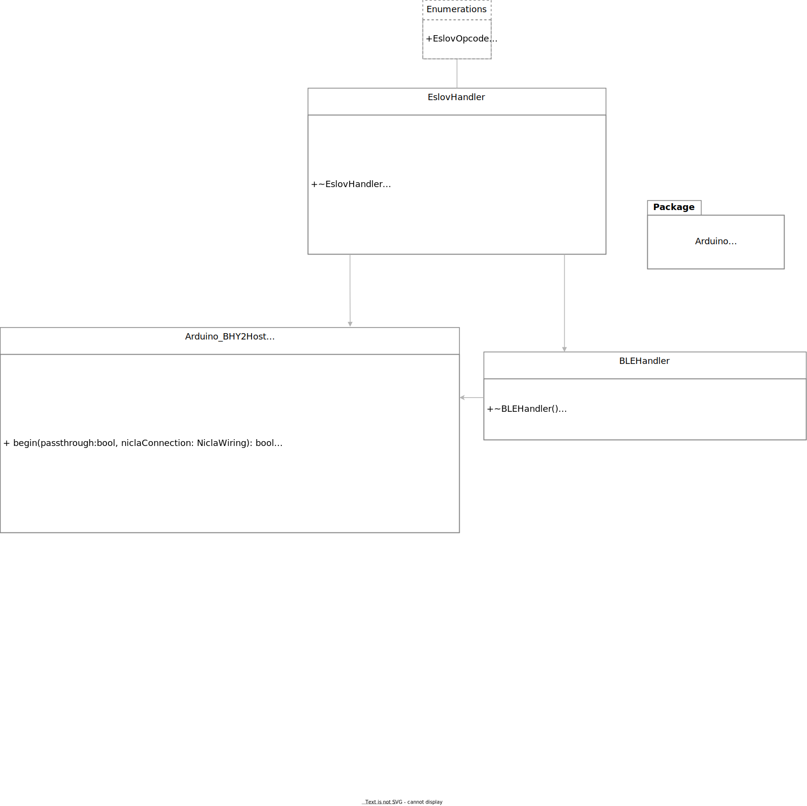

# Bosch BHY2 Host Sensor Library for Arduino

This library provides capabilities for the Portenta and MKR boards to interact with the Nicla Sense ME and poll the BHI260AP and BME688 sensors. This library is included on sketches from the host board (not the Nicla Sense ME board).

## Features

- Easy access to data from Nicla Sense ME sensors from the Portenta and MKR boards
- Wrapper for [Bosch BHY2-Sensor-API](https://github.com/BoschSensortec/BHY2-Sensor-API)
- Bridge for data to the Arduino IoT Cloud
- All functionality available over both I2C/ESLOV and BLE

## Usage

The ArduinoBLE library needs to be installed, for the BLE features to function.

To use this library, use this code at the top of your sketch
```
#include <Arduino_BHY2host.h>
```

A UML diagram of the main library classes is provided in the diagram below, provided as an editable SVG file.




## Examples

- [Accelerometer](https://github.com/arduino-libraries/Arduino_BHY2Host/blob/main/examples/Accelerometer/Accelerometer.ino) : Read accelerometer data from a Nicla Sense ME connected to a host board, and print to the Serial monitor  
- [BSEC](https://github.com/arduino-libraries/Arduino_BHY2Host/blob/main/examples/BSEC/BSEC.ino) : Read BSEC data from a Nicla Sense ME connected to a host board, and print to the Serial monitor
- [Nicla_IoT_Bridge](https://github.com/arduino-libraries/Arduino_BHY2Host/blob/main/examples/Nicla_IoT_Bridge/Nicla_IoT_Bridge.ino) :  Obtain temperature data from a Nicla Sense ME board and send data to the Arduino IoT Cloud 
- [Orientation](https://github.com/arduino-libraries/Arduino_BHY2Host/blob/main/examples/Orientation/Orientation.ino) : Read orientation data from a Nicla Sense ME connected to a host board, and print to the Serial monitor
- [Passthrough](https://github.com/arduino-libraries/Arduino_BHY2Host/blob/main/examples/Passthrough/Passthrough.ino) : Control the Nicla Sense ME over Serial commands, via a host board using the arduino-bhy tool
- [Portenta_BLE_Bridge](https://github.com/arduino-libraries/Arduino_BHY2Host/blob/main/examples/Portenta_BLE_Bridge/Portenta_BLE_Bridge.ino) :  Obtain temperature data from a Nicla Sense ME board over BLE and send data to the Arduino IoT Cloud via the Portenta H7
- [Portenta_BLE_Bridge](https://github.com/arduino-libraries/Arduino_BHY2Host/blob/main/examples/Portenta_BLE_Bridge/Portenta_BLE_Bridge.ino) :  Obtain temperature data from a Nicla Sense ME board over BLE and send data to the Arduino IoT Cloud via the Portenta H7
- [Temperature](https://github.com/arduino-libraries/Arduino_BHY2Host/blob/main/examples/Temperature/Temperature.ino) :  Obtain temperature data from a Nicla Sense ME board and send it over Serial 

## License

See [LICENSE.txt](LICENSE.txt)